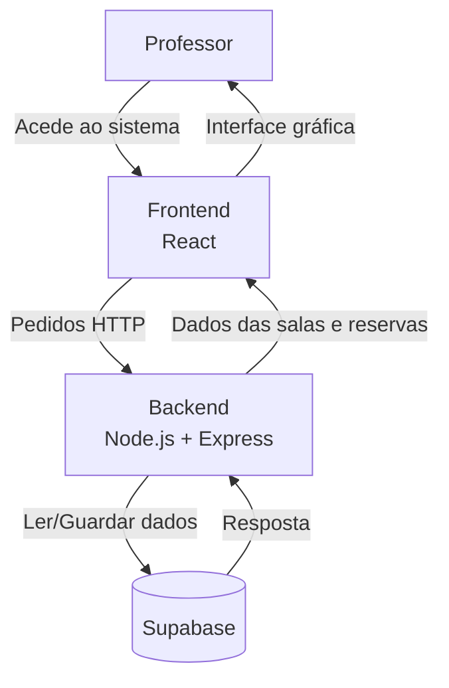

```mermaid
flowchart TD

Professor[Professor]

Frontend[Frontend<br/>React]

Backend[Backend<br/>Node.js + Express]

DB[(Supabase)]

Professor -->|Acede ao sistema| Frontend

Frontend -->|Pedidos HTTP| Backend

Backend -->|Ler/Guardar dados| DB

DB -->|Resposta| Backend

Backend -->|Dados das salas e reservas| Frontend

Frontend -->|Interface gráfica| Professor
```