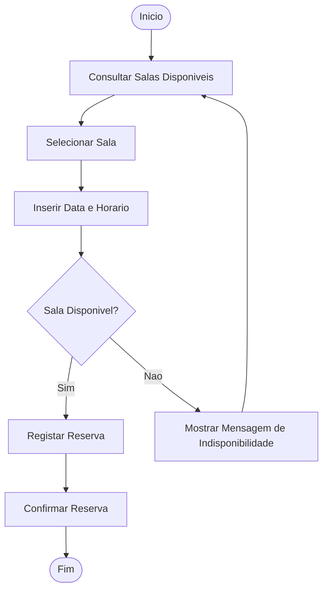

```mermaid
flowchart TD

A([Inicio]) --> B[Consultar Salas Disponiveis]
B --> C[Selecionar Sala]
C --> D[Inserir Data e Horario]

D --> E{Sala Disponivel?}

E -->|Sim| F[Registar Reserva]
F --> G[Confirmar Reserva]
G --> H([Fim])

E -->|Nao| I[Mostrar Mensagem de Indisponibilidade]
I --> B
```